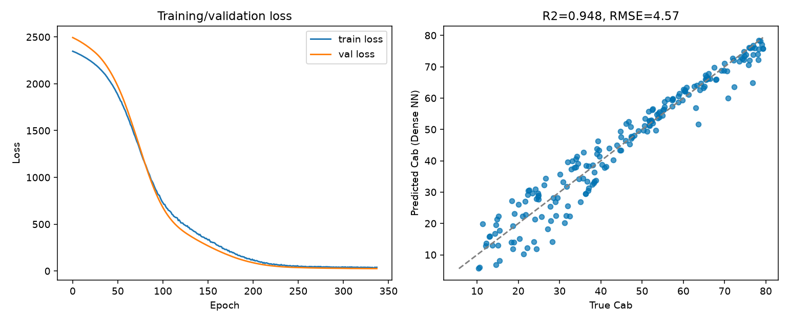

14. Deep-Learning Inversion
================================

What you will learn
------------------------

- The full deep-learning inversion workflow, with every preprocessing
  step made explicit -- nothing hidden inside a function call.
- What normalization does, why it's needed, and why it must be fitted
  on training data only.
- What epochs, batches, optimizer, validation, and early stopping each
  actually control.

Concept
-----------

Deep learning solves the same problem as :doc:`t13-machine-learning-inversion`
(predict a trait from a spectrum) with a neural network instead of a
classical estimator. :func:`~toolsrtm.deep_learning.get_ml_model` offers
two architectures: a dense (fully-connected) network, and a 1D
convolutional network (CNN) that treats predictor bands *in spectral
order* -- useful when predictors are many contiguous hyperspectral
bands, since nearby-band structure is then something the network can
actually exploit (a dense network sees predictors as an unordered set;
a 1D-CNN sees them as a sequence).

Python tools used
----------------------

.. list-table::
   :header-rows: 1
   :widths: 25 75

   * - Function
     - Key arguments
   * - :func:`~toolsrtm.deep_learning.get_ml_model`
     - ``dataset`` (LUT DataFrame -- **every column except** ``dep_var``
       becomes a predictor), ``dep_var``, ``model`` (``"Hidden-layers"``
       or ``"CNN"``), ``optimizer`` (``"adam"``, ``"sgd"``, ...),
       ``batch_size``, ``n_epochs`` (a *ceiling*, not a target -- early
       stopping usually stops sooner), ``prop_split`` (train/validation
       fraction, default ``(0.8, 0.2)``), ``n_layers``/``n_neurons``
       (dense architecture), ``n_times`` (independent random restarts,
       best one kept), ``seed``. Returns ``.model`` (the fitted Keras
       model), ``.x_scaler`` (fitted ``StandardScaler``), ``.history``
       (per-epoch train/val loss), ``.stats``/``.predictions`` (on the
       held-out validation split).

What happens inside, step by step
----------------------------------------

1. **Predictors and target**: every column of ``dataset`` except
   ``dep_var`` is used as a predictor -- if your LUT has a trait column
   you don't want the network to see (e.g. a second trait, or a soil
   parameter), drop it before calling.
2. **Train/validation split**: ``prop_split=(0.8, 0.2)`` splits *before*
   anything else touches the data.
3. **Normalization**: predictors are standardized
   (``StandardScaler().fit(X_train)``) -- each predictor rescaled to
   zero mean, unit variance. Neural networks train far more reliably on
   inputs of comparable scale; without it, a predictor with naturally
   larger raw values can dominate early gradients for no physically
   meaningful reason.
4. **Why train-only**: the scaler is fit on ``X_train`` *only*, then
   applied (never refit) to the validation set. Fitting on the full
   dataset would leak validation-set statistics (its mean/variance) into
   training -- a subtle form of data leakage that inflates validation
   performance relative to what the model would do on genuinely new
   data.
5. **Epochs / batch size**: ``n_epochs`` is a ceiling on training
   passes over the data; ``batch_size`` is how many rows are averaged
   per gradient update. Larger batches give smoother but less frequent
   updates.
6. **Optimizer**: controls *how* weights are updated from the computed
   gradient (``"adam"`` here -- an adaptive per-weight learning rate,
   the most common default).
7. **Validation + early stopping**: validation loss is tracked every
   epoch; training stops once it stops improving for a few consecutive
   epochs (patience-based), and the *best* epoch's weights are restored
   -- not necessarily the last epoch's.

Run the example
--------------------

.. code-block:: python

   import numpy as np
   import pandas as pd
   from sklearn.model_selection import train_test_split
   from toolsrtm.deep_learning import get_ml_model

   # lut_df: the same 1000-row LUT from t11-lut-generation (Cab, LAI + 10 bands)
   result = get_ml_model(lut_df, dep_var="Cab", model="Hidden-layers",
                          n_epochs=500, n_times=3, seed=2)
   print("Held-out R2:", result.stats["r2"])
   print("Held-out RMSE:", result.stats["rmse"])
   print("Epochs actually run:", len(result.history["loss"]), "of 500 requested")

   # Applying the fitted scaler to new data -- required before predicting
   predictor_cols = [c for c in lut_df.columns if c != "Cab"]
   X = lut_df[predictor_cols].to_numpy(dtype=float)
   y = lut_df["Cab"].to_numpy(dtype=float)
   X_train, X_val, y_train, y_val = train_test_split(X, y, test_size=0.2, random_state=2)
   X_val_scaled = result.x_scaler.transform(X_val)
   pred_val = result.model.predict(X_val_scaled, verbose=0).ravel()

Result
----------

Printed output (from an actual run -- Keras' own internal stochasticity
means your exact loss values may differ slightly, but the shape and
final R2/RMSE will match closely)::

   Held-out R2: 0.946762574572728
   Held-out RMSE: 4.565467911050133
   Epochs actually run: 339 of 500 requested

   Real output: training/validation loss over 339 epochs (left -- early stopping triggered well before the 500-epoch ceiling, and train/val loss track closely throughout, no overfitting gap), and predicted vs. true Cab on the held-out validation set (right, R2=0.948).

Interpretation
-------------------

This is a genuinely successful fit: R2=0.95, and the loss curve shows
the textbook healthy pattern -- both train and validation loss decrease
together and plateau at nearly the same value, with no widening gap that
would signal overfitting. Early stopping triggered at epoch 339, well
short of the 500-epoch ceiling -- the network had already converged, and
training further would mostly add compute time, not accuracy. The
scatter plot's remaining spread (points off the 1:1 line, mostly at
low-to-mid Cab) reflects genuine irreducible noise/ambiguity in a
10-band multispectral retrieval problem, not a training failure --
compare against :doc:`t12-lut-inversion`/:doc:`t13-machine-learning-inversion`'s
own R2 on the same underlying problem for context.

Try it yourself
--------------------

- Predict on ``X_val`` **without** applying ``result.x_scaler`` first
  (raw reflectance straight into ``result.model.predict``) and see how
  badly R2 collapses -- this is the exact scaling bug documented and
  fixed in `ToolsRTM Tutorial 13
  <https://ccgcam.github.io/RTM-Suite/toolsrtm/articles/t13-deep-learning-inversion.html>`_,
  reproduced here deliberately so you can see its effect firsthand.
- Try ``model="CNN"`` on a wider, contiguous hyperspectral band set
  (e.g. every 10nm from 450-2390nm) instead of 10 scattered
  multispectral bands, and compare R2 against the dense network here.
- Reduce ``n_epochs`` to 50 (well below where early stopping triggered
  above) and check how much worse (higher loss, lower R2) the
  under-trained result is.

Common mistakes
--------------------

- Forgetting to apply ``result.x_scaler`` before predicting on new data
  is the single most common way to get silently wrong DL predictions --
  see "Try it yourself" above to see it happen on purpose.
- ``n_epochs`` is a ceiling, not a guarantee -- checking
  ``len(result.history["loss"])`` (as done above) tells you how many
  epochs actually ran before early stopping.
- A relu activation on the final output layer of a regression network
  can get permanently stuck at 0 (a dead-gradient failure mode) --
  ``get_ml_model`` already uses a linear output activation specifically
  to avoid this (see the function's own source comment), but it's worth
  knowing if you ever build a custom architecture by hand.

Next
--------

:doc:`t15-choosing-inversion-strategy` -- LUT matching vs. ML vs. DL,
compared directly, and when each is the right choice.

----

Using R? -> `ToolsRTM Tutorial 13: Deep-Learning Inversion
<https://ccgcam.github.io/RTM-Suite/toolsrtm/articles/t13-deep-learning-inversion.html>`_
