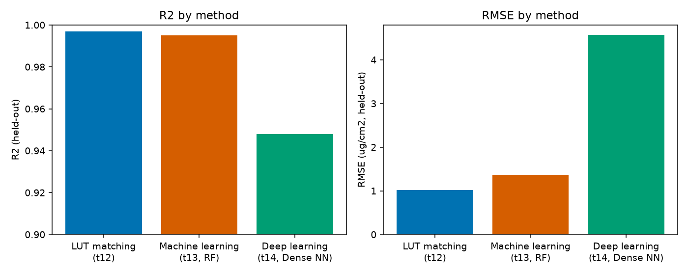

15. Choosing an Inversion Strategy
=======================================

What you will learn
------------------------

- A direct, at-a-glance comparison of LUT matching, machine learning,
  and deep learning on the same underlying retrieval problem.
- Data requirements, interpretability, and computational cost for each.
- Enough to pick a reasonable starting point without re-reading Chapters
  12-14 first.

Concept
-----------

.. list-table::
   :header-rows: 1
   :widths: 18 20 20 20 22

   * - Method
     - Data needed
     - Interpretability
     - Compute cost
     - Best when
   * - :doc:`t12-lut-inversion` (merit function)
     - A LUT, no training
     - High (see the exact matching spectra)
     - Cheap per call, no training step, but a full LUT scan every time
     - Small LUT, want it fast and interpretable, no retraining hassle
   * - :doc:`t13-machine-learning-inversion` (RF/PLSR/SVM/...)
     - A LUT to train on once
     - Medium (feature importance available)
     - One training cost, then very cheap prediction
     - Default choice for most trait-retrieval work
   * - :doc:`t14-deep-learning-inversion` (Dense/1D-CNN)
     - A larger LUT, more tuning
     - Low (a black box, though loss curves show *if* it learned)
     - Highest training cost (many epochs, optional GPU), cheap prediction
     - Wide hyperspectral input, willing to tune a network, ML already
       tried and insufficient

Run the example
--------------------

The exact held-out results from Chapters 12-14, on the same 1000-row LUT
(:doc:`t11-lut-generation`), Cab as the target trait:

.. code-block:: python

   methods = ["LUT matching (t12)", "Machine learning (t13, RF)", "Deep learning (t14, Dense NN)"]
   r2 = [0.997, 0.995, 0.948]
   rmse = [1.02, 1.37, 4.57]   # ug/cm2

Result
----------

   Real numbers, taken directly from Chapters 12-14's own evaluations.

Interpretation
-------------------

All three retrieve Cab well here (R2 >= 0.95), but this comparison isn't
perfectly apples-to-apples and shouldn't be read as "LUT matching beats
DL": Chapter 12 evaluated on 30 independently-simulated held-out
observations, while Chapters 13-14 evaluated on a 300-row held-out split
of the *same* 1000-row LUT -- different test sets, different difficulty.
The honest takeaway is qualitative, not a precise ranking: all three
methods can retrieve a well-behaved trait like Cab from a clean,
noise-free, same-distribution LUT to a similar standard, and the real
differences between them show up in what Chapter 14 already flagged for
DL specifically (mean-reversion at trait extremes, sensitivity to
preprocessing mistakes) and in what only shows up once you leave this
idealized setting -- real sensor noise, real atmospheric/soil
confounding, real out-of-distribution trait combinations
(:doc:`t18-applying-inversion-spatially`).

Try it yourself
--------------------

- Re-run all three methods on the *same* 30 held-out observations from
  Chapter 12, for a genuinely apples-to-apples comparison.
- Re-run all three after adding :doc:`t11-lut-generation`'s noise step to
  both the LUT and the test observations, and see which method's R2
  degrades the most.
- Time each method's training + prediction step (``%%timeit`` in a
  notebook) to get a feel for the real compute-cost gap the table above
  only describes qualitatively.

Common mistakes
--------------------

- Don't pick DL by default "because it's more advanced" -- Chapter 14's
  own guidance is to confirm ML doesn't already solve the problem first,
  since it usually does, at a fraction of the tuning effort.
- A method's R2 on clean simulated data is not a promise of the same R2
  on real observations -- always budget for degradation once real noise
  and confounding enter (Part IV).
- Comparing methods evaluated on different held-out sets (as this
  chapter's own numbers are) can be misleading -- always compare on
  identical test data when the choice actually matters for a real
  project.

Next
--------

Part IV starts here: :doc:`t16-retrieving-eo-data` -- taking any of
these trained inversion methods to a real satellite scene.

----

Using R? -> `ToolsRTM Tutorial 12: ML Inversion Comparison
<https://ccgcam.github.io/RTM-Suite/toolsrtm/articles/t12-ml-inversion-comparison.html>`_
