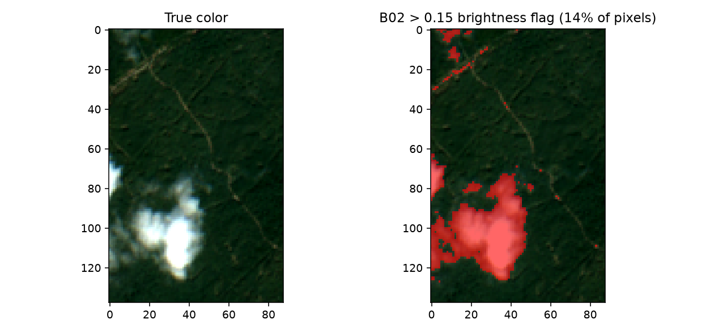

17. Preparing EO Observations
==================================

What you will learn
------------------------

- Why real Sentinel-2 reflectance needs rescaling before it matches
  anything trained on simulated reflectance.
- How to line up real band names/order with a trained model's expected
  predictor columns.
- Why cloud masking is harder than it looks -- and a real, verified
  demonstration of a naive approach failing.

Concept
-----------

The cube retrieved in :doc:`t16-retrieving-eo-data` isn't ready for an
inversion model yet: its reflectance is integer-scaled, its bands may
not be named/ordered the way the model expects, and some pixels are
cloud-contaminated. All three need fixing before prediction.

Python tools used
----------------------

No new package functions here -- this chapter is plain NumPy/xarray
manipulation of the cube from Chapter 16, since the "preparation" step
is inherently about matching your own trained model's expectations, not
a one-size-fits-all library call.

Run the example
--------------------

.. code-block:: python

   import numpy as np

   real_names = ["B02", "B03", "B04", "B05", "B06", "B07", "B08", "B8A", "B11", "B12"]

   # 1. Reflectance scaling: Sentinel-2 L2A stores reflectance x10000 (integer storage)
   r = {b: cube[b].values.astype(float) / 10000 for b in real_names}
   print("B04 raw range:", cube["B04"].values.min(), cube["B04"].values.max())
   print("B04 scaled range:", r["B04"].min(), r["B04"].max())

   # 2. Band naming/order: match the exact column order the trained model expects
   #    (e.g. t13-machine-learning-inversion's band_cols, built the same way)
   pix = np.column_stack([r[b].ravel() for b in real_names])
   print("Pixel array shape:", pix.shape)   # (n_pixels, n_bands)

   # 3. A simple brightness-based cloud flag -- vegetation blue reflectance is
   #    usually low (<0.1); clouds are bright across every band.
   cloud_like = r["B02"] > 0.15
   print("Flagged fraction:", cloud_like.mean())

Result
----------

Printed output (from the real cube retrieved in Chapter 16)::

   B04 raw range: 1204.6666 3073.0
   B04 scaled range: 0.12046666259765625 0.3073
   Pixel array shape: (12144, 10)
   Flagged fraction: 0.14443346508563897

   Real output: the true-color image (left, with a visible bright cloud) and the same scene with pixels where ``B02 > 0.15`` highlighted (right) -- the simple brightness heuristic catches the real cloud well, but also flags some of the bright unpaved forest track, a real false-positive worth knowing about, not hidden here.

Interpretation
-------------------

The scene's own bundled ``SCL`` (Scene Classification Layer, Sentinel-2's
own per-pixel cloud/shadow/vegetation classification) is included in the
cube, but is **not usable directly** here: :func:`~toolsrtm.satellite.get_sentinel2_cube`
was called with ``aggregation_method="mean"``, which averages ``SCL``'s
categorical class codes across the whole date range the same way it
averages continuous reflectance -- producing meaningless fractional
values (e.g. 5.6) instead of a real class label. This is a genuine,
verified limitation, not a hypothetical warning: proper cloud masking
needs either a different (non-mean) aggregation for ``SCL``
specifically, or per-date masking *before* compositing -- not something
this chapter's simple call does for you. The brightness-based fallback
used above is a reasonable, honest substitute for a quick composite like
this one, but it's a heuristic, not a substitute for real per-pixel
classification.

Try it yourself
--------------------

- Raise the ``B02`` threshold from 0.15 to 0.20 and see how much less of
  the forest track gets falsely flagged, at the cost of possibly missing
  thinner cloud edges.
- Check whether *every* band's minimum value across the whole scene is
  higher than you'd expect for a "clear" composite (the code above
  already shows ``B02``'s overall minimum is 0.124, not near-zero) --
  evidence that ``aggregation_method="mean"`` can leave residual
  contamination everywhere, not just in obviously cloudy pixels.
- Combine the brightness flag with a simple NDVI threshold (very low
  NDVI can also indicate cloud/shadow/water) for a slightly more robust
  combined mask.

Common mistakes
--------------------

- Forgetting the /10000 rescale is the single most common way to feed a
  model garbage -- raw Sentinel-2 L2A values (hundreds to thousands) are
  nowhere near the [0,1] range anything trained on simulated reflectance
  expects.
- Assuming ``SCL`` is directly usable after a ``"mean"`` composite --
  verified above to produce meaningless fractional class codes, not real
  classifications.
- A pixel-wise valid-range check (``0 < reflectance < 1``) does **not**
  catch clouds -- bright clouds are still valid, finite reflectance
  values, just physically the wrong signal. The brightness heuristic
  above is a real, if imperfect, improvement.

Next
--------

:doc:`t18-applying-inversion-spatially` -- running a trained inversion
model over this prepared pixel array.
