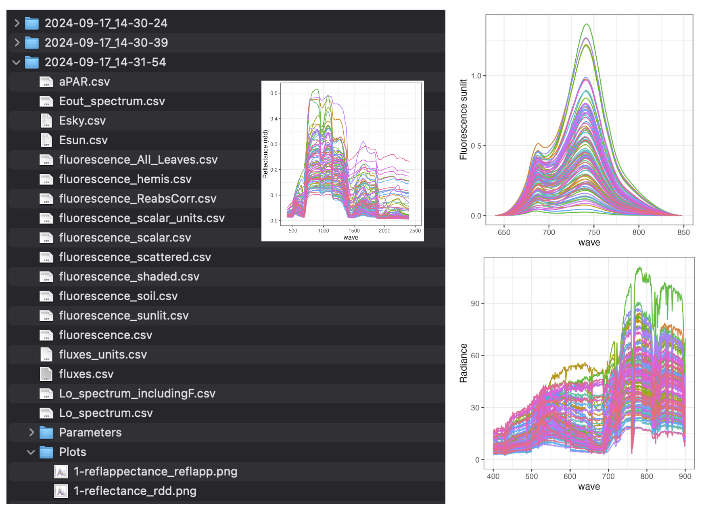

# SCOPE in Python

[](https://gitlab.com/caminoccg/scopeinr) [](https://github.com/CCGCAM/RTM-Suite/tree/main/python/scopeinpython)

Python port of [`SCOPEinR`](https://gitlab.com/caminoccg/scopeinr) (R) -- the SCOPE model (Soil Canopy Observation, Photochemistry and Energy fluxes): soil reflectance, canopy optical BRDF, leaf photosynthesis and fluorescence, and the full thermal energy-balance closure, coupled into one simulation from a single LUT input row.

Every module is verified against a real, unmodified call to the original R package -- numbers match to floating-point precision unless noted otherwise (documented per-module where they don't). See [`verification.rst`](https://github.com/CCGCAM/RTM-Suite/blob/main/python/docs/verification.rst) for the full per-function verification details.

**How this fits together**: this package isn't a separate reimplementation drifting from the R original -- it's developed, tested, and verified inside the same [`RTM-Suite`](https://github.com/CCGCAM/RTM-Suite) monorepo as `SCOPEinR` (R) itself, so the two stay in sync. It depends on [`toolsrtm`](https://github.com/CCGCAM/ToolsRTMinPython) (the Python port of `ToolsRTM`) for leaf optics (PROSPECT-D/PROSPECT-PRO), the same relationship `SCOPEinR` has to `ToolsRTM` in R. Together, both packages cover the full loop this suite is built for: simulate leaf-to-canopy reflectance/fluorescence from biophysical traits, convolve it onto a real sensor's bands, run it through this package's energy-balance/fluorescence chain, and invert real observations back to those traits with classical ML or deep learning (via `toolsrtm.inversion`/`toolsrtm.deep_learning`).

## What's in it

| Component | What it does |
|------------------------------------|------------------------------------|
| **`soil`** | BSM (Brightness-Shape-Moisture) soil reflectance model |
| **`rtmo`** | Optical top-of-canopy BRDF: leaf optics + soil + geometry -\> `rdd`/`rsd`/`rdo`/`rso`, gap probabilities |
| **`fluspect` / `fluspect_mscope`** | SCOPE's own Fluspect-B-Cx leaf-optics variant, and the multi-layer (mSCOPE) canopy wrapper built on it |
| **`biochemical`** | Farquhar/Collatz C3/C4 photosynthesis + van der Tol et al. (2014) fluorescence yield, given a leaf's micro-environment |
| **`rtmf` / `rtmz`** | Canopy fluorescence and zeaxanthin-state radiative transfer |
| **`thermal` / `rtmt_sb` / `ebal`** | Aerodynamic resistances, heat fluxes, thermal-IR outgoing radiation, and the full energy-balance closure loop (iterates sunlit/shaded leaf + soil temperature until fluxes balance) |
| **`scope`** | End-to-end wrapper: one LUT input row in, full simulation (optical + energy balance + optional fluorescence/zeaxanthin) out |

Depends on [`toolsrtm`](https://github.com/CCGCAM/ToolsRTMinPython) for leaf optics (PROSPECT-D/PROSPECT-PRO), exactly as the R `SCOPEinR` package depends on `ToolsRTM`.

`scopeinpython` is one library within [**RTM-Suite**](https://ccgcam.github.io/RTM-Suite/), which links both the R packages (`ToolsRTM`, `SCOPEinR`) and their Python ports (`toolsrtm`, `scopeinpython`) behind one common site -- with reference manuals, worked tutorials, and runnable example pipelines for both languages side by side.


The [RTM-Suite website](https://ccgcam.github.io/RTM-Suite/) -- see **Documentation** for R/Python reference manuals, **Tutorials** for step-by-step walkthroughs (R and Python side by side), and **Examples** for copy-paste runnable code with real generated figures.

## Install

``` bash
pip install git+https://github.com/CCGCAM/scopeinpython.git
```

or, editable, from a local clone:

``` bash
git clone https://github.com/CCGCAM/scopeinpython.git
cd scopeinpython
pip install -e ".[test]"
pytest tests -q
```

## Quick example

``` python
from scopeinpython import get_scope

result = get_scope(lut_row, options)   # one LUT row -> full SCOPE simulation
print(result.refl[:5])                 # top-of-canopy reflectance
print(result.Tcave, result.Tsave)      # converged leaf/soil temperatures
```

<p align="center">



</p>

## Documentation & tutorials

This repo is deliberately just the installable package -- everything else (manuals, worked tutorials, the course materials this was built for) lives in [`CCGCAM/RTM-Suite`](https://github.com/CCGCAM/RTM-Suite), the monorepo this package is developed and verified in and kept in sync with:

- **Manual** (every function's full docstring, browsable): [`docs/python/index.html`](https://github.com/CCGCAM/RTM-Suite/blob/main/docs/python/index.html)
- **Tutorial, step by step** (run SCOPE once -\> explore reflectance/ fluorescence/temperature/fluxes -\> a small LUT), R side-by-side with Python: [`Tutorials/How-in-Python-SCOPEinR.ipynb`](https://github.com/CCGCAM/RTM-Suite/blob/main/Tutorials/How-in-Python-SCOPEinR.ipynb) (R version: `How-in-R-SCOPEinR.Rmd`)
- **Complete reference manual** (every input table, sensitivity to soil/ photosynthesis settings, serial and parallel runs) -- currently R only: [`Tutorials/SCOPEinR_tutorial.Rmd`](https://github.com/CCGCAM/RTM-Suite/blob/main/Tutorials/SCOPEinR_tutorial.Rmd)
- **A real, runnable pipeline script** (run SCOPE once -\> explore every output -\> simulate a LUT of many runs): [`Scripts/Python/ForSCOPE_Python/README.md`](https://github.com/CCGCAM/RTM-Suite/blob/main/Scripts/Python/ForSCOPE_Python/README.md)
- **Full writeup** -- every module ported, with its numerical verification status: [`python/README.md`](https://github.com/CCGCAM/RTM-Suite/blob/main/python/README.md)

## License

[](#0) [](#0) [](#0)

`scopeinpython` is a Python port of **SCOPE**, whose own reference implementation ([`Christiaanvandertol/SCOPE`](https://github.com/Christiaanvandertol/SCOPE)) is GPL-3.0-licensed. Since this package's entire purpose is porting SCOPE, `scopeinpython` is distributed under **GPL-3.0-only** (see [`LICENSE`](LICENSE)), matching its R sibling package `SCOPEinR`'s own `License: GPL-3` field.

Unlike `toolsrtm` (which mixes ported models with a substantial layer of original inversion/convolution/LUT tooling), `scopeinpython` is a **deliberately scoped, near-total port of SCOPE's own physics** (`rtmo`, `rtmf`, `rtmt_sb`, `rtmz`, `soil`, `biochemical`, `ebal`, `fluspect*`, and the `scope.get_scope()` orchestrator that mirrors SCOPE's own top-level run function) -- there is no comparably-sized independent utility layer to license separately, so this package is GPL-3.0 throughout. Trait inversion and machine-learning tooling for SCOPE-simulated data lives in `toolsrtm.inversion` instead (MIT individually, see that package's [`THIRD_PARTY_LICENSES.md`](https://github.com/CCGCAM/ToolsRTMinPython/blob/main/THIRD_PARTY_LICENSES.md)).

See [`THIRD_PARTY_LICENSES.md`](THIRD_PARTY_LICENSES.md) for the full source-code provenance and citation details. `scopeinpython` depends on [`toolsrtm`](https://github.com/CCGCAM/ToolsRTMinPython) for leaf-level optics -- see that package's own `THIRD_PARTY_LICENSES.md` for the licensing of those specific leaf models. Always cite the original SCOPE publication(s) when using this package in scientific work, in addition to citing RTM-Suite/SCOPEinR.
